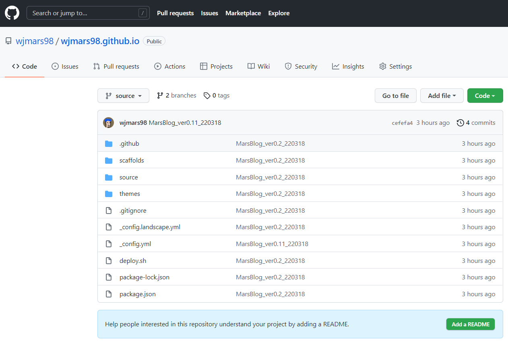
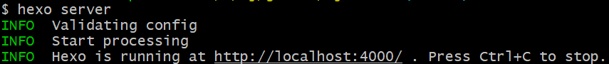
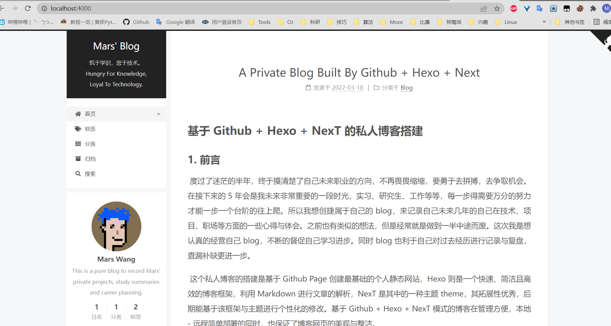
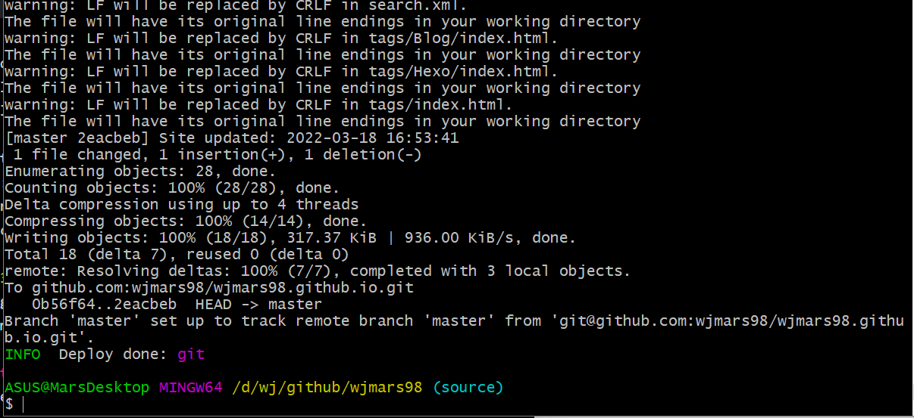

这个私人博客的搭建是基于Github Page创建最基础的个人静态网站，Hexo则是一个快速、简洁且高效的博客框架，利用Markdown进行文章的解析，NexT是其中的一种主题theme，其拓展性优秀，后期能基于该框架与主题进行个性化的修改。基于Github + Hexo + NexT模式的博客在管理方便，实现本地-远程简单部署的同时，也保证了博客网页的美观与整洁。

本文将从以下几个部分来记录该博客的搭建:

	- 项目构建及其部署
	- 配置文件功能解析
	- 基于该框架主题的DIY
	- 难点与收获

<!--more-->


# 前言

​		度过了迷茫的半年，终于摸清楚了自己未来职业的方向，不再畏畏缩缩，要勇于去拼搏，去争取机会。在接下来的5年会是我未来非常重要的一段时光，实习、研究生、工作等等，每一步得需要万分的努力才能一步一个台阶的往上爬。所以我想创捷属于自己的blog，来记录自己未来几年的自己在技术、项目、职场等方面的一些心得与体会。之前也有类似的想法，但是经常就是做到一半中途而废。这次我是想认真的经营自己blog，不断的督促自己学习进步。同时blog也利于自己对过去经历进行记录与复盘，查漏补缺更进一步。

​		这个私人博客的搭建是基于Github Page创建最基础的个人静态网站，Hexo则是一个快速、简洁且高效的博客框架，利用Markdown进行文章的解析，NexT是其中的一种主题theme，其拓展性优秀，后期能基于该框架与主题进行个性化的修改。基于Github + Hexo + NexT模式的博客在管理方便，本地-远程简单部署的同时，也保证了博客网页的美观与整洁。

​		本文将从以下几个部分来记录该博客的搭建:

- 项目构建及其部署
- 配置文件功能解析
- 基于该框架主题的DIY
- 难点与收获


​		个人链接: 

>1.  [Mars' Github Home](https://github.com/wjmars98)
>
>2.  [Mars' Blog Home Page](https://wjmars98.github.io/) 


# 项目构建及其部署

## 准备条件

​		该博客主要是利用Github为其每个用户提供的Github Pages服务，允许用户搭建一个静态网站。所以首先需要Github上构建名为:{username}.github.io的仓库，其名字必须由“.github.io”结尾。同时为了后续的操作便利，[需要配置本地与Github的ssh连接](https://docs.github.com/cn/authentication/connecting-to-github-with-ssh/about-ssh)。

​		同时还需安装Node.js，Hexo。

```bash
# node.js
# download from https://nodejs.org/zh-cn/download/

# Hexo 安装
npm install -g hexo-cli
```


<center>
    
</center>


<center>
     
</center>


## 项目初始及本地搭建


​		首先, 需要创建项目，利用指令

```bash
# hexo init {name}
# 我的项目名为wjmars98
hexo init wjmars98
```

在wjmars98文件夹下面出现Hexo的初始化文件，各个文件的具体细节下一章再展开。


<center>
     
</center>

​		第二，需要将Hexo编译成HTML文件，调用指令

```bash
# 编译形成HTML文件
hexo generate
```

输出结果里面包含了 js、css、font 等内容，处在了项目根目录下的 public 文件夹下面，随后利用Hexo提供的Server服务，将其在本地运行起来

```bash
# 启动hexo服务器
hexo server
```

随后可以在本地4000端口查看博客站点，如下所示,其中图例是已经选用next的情况。


<center>
     
</center>


<center>
     
</center>


## 项目部在Github Page上的部署

​		为了便利后面的操作，我们将部署的shell脚本写在 *deploy.sh* 的脚本文件上

``` bash
# deploy.sh 文件
hexo clean
hexo generate
hexo deploy
```

利用 *sh deploy.sh* 指令就能完成部署操作。


​		在部署之前，我们还需要修改部署文件细节。打开根目录下的 _config.yml 文件，找到 Deployment 这个地方，把刚才新建的 Repository 的地址贴过来，然后指定分支为 master 分支，最终修改为如下内容：

``` bash
# Deployment
## Docs: https://hexo.io/docs/deployment.html
deploy:
  type: git
  # 替换成个人github上的git地址
  repo: {git repo ssh address}
  branch: master
```

还需安装支持 Git 的部署插件，名字叫做 hexo-deployer-git，然后才能顺利部署到Github上

``` bash
# 插件安装
npm install hexo-deployer-git --save

# 部署命令
hexo deploy

# 如果不按照会报错
# Deployer not found: git
```

<center>
     
</center>

​		此时打开https://wjmars98.github.io 便可以打开网站。


# 配置文件功能解析

​		在第二章中，我们初步完成了hexo地搭建以及在Github Page上地部署，文件夹为wjmars98，本章将对该文件夹下地配置文件进行详细解析。	

​		首先是wjmars98文件夹的文件树:

``` bash
    .
    ├── _config.yml # 网站的 配置 信息，您可以在此配置大部分的参数
    ├── package.json # 应用程序的信息。
    ├── scaffolds # 模版 文件夹。当您新建文章时，Hexo 会根据 scaffold 来建立文件。
    ├── source # 资源文件夹是存放用户资源的地方。
    |   ├── _drafts	# 草稿
    |   └── _posts # 文章
    └── themes # 主题 文件夹。Hexo 会根据主题来生成静态页面。
```

​		我们可以在_config.yml中修改大部分配置。


## Site

| 参数          | 描述                                                         |
| :------------ | :----------------------------------------------------------- |
| `title`       | 网站标题                                                     |
| `subtitle`    | 网站副标题                                                   |
| `description` | 网站描述                                                     |
| `keywords`    | 网站的关键词。支持多个关键词。                               |
| `author`      | 您的名字                                                     |
| `language`    | 网站使用的语言。对于简体中文用户来说，使用不同的主题可能需要设置成不同的值，请参考你的主题的文档自行设置，常见的有 `zh-Hans`和 `zh-CN`。 |
| `timezone`    | 网站时区。Hexo 默认使用您电脑的时区。请参考 [时区列表](https://en.wikipedia.org/wiki/List_of_tz_database_time_zones) 进行设置，如 `America/New_York`, `Japan`, 和 `UTC` 。一般的，对于中国大陆地区可以使用 `Asia/Shanghai`。 |


## Categories

|                |                                                              |                  |
| :------------- | :----------------------------------------------------------- | :--------------- |
| 参数           | 描述                                                         | 默认值           |
| `source_dir`   | 资源文件夹，这个文件夹用来存放内容。                         | `source`         |
| `public_dir`   | 公共文件夹，这个文件夹用于存放生成的站点文件。               | `public`         |
| `tag_dir`      | 标签文件夹                                                   | `tags`           |
| `archive_dir`  | 归档文件夹                                                   | `archives`       |
| `category_dir` | 分类文件夹                                                   | `categories`     |
| `code_dir`     | Include code 文件夹，`source_dir` 下的子目录                 | `downloads/code` |
| `i18n_dir`     | 国际化（i18n）文件夹                                         | `:lang`          |
| `skip_render`  | 跳过指定文件的渲染。匹配到的文件将会被不做改动地复制到 `public` 目录中。您可使用 [glob 表达式](https://github.com/micromatch/micromatch#extended-globbing)来匹配路径。 |                  |


## Writing

| 参数                    | 描述                                                         | 默认值    |
| :---------------------- | :----------------------------------------------------------- | :-------- |
| `new_post_name`         | 新文章的文件名称                                             | :title.md |
| `default_layout`        | 预设布局                                                     | post      |
| `auto_spacing`          | 在中文和英文之间加入空格                                     | false     |
| `titlecase`             | 把标题转换为 title case                                      | false     |
| `external_link`         | 在新标签中打开链接                                           | true      |
| `external_link.enable`  | 在新标签中打开链接                                           | `true`    |
| `external_link.field`   | 对整个网站（`site`）生效或仅对文章（`post`）生效             | `site`    |
| `external_link.exclude` | 需要排除的域名。主域名和子域名如 `www` 需分别配置            | `[]`      |
| `filename_case`         | 把文件名称转换为 (1) 小写或 (2) 大写                         | 0         |
| `render_drafts`         | 显示草稿                                                     | false     |
| `post_asset_folder`     | 启动 [Asset 文件夹](https://hexo.io/zh-cn/docs/asset-folders) | false     |
| `relative_link`         | 把链接改为与根目录的相对位址                                 | false     |
| `future`                | 显示未来的文章                                               | true      |
| `highlight`             | 代码块的设置, 请参考 [Highlight.js](https://hexo.io/docs/syntax-highlight#Highlight-js) 进行设置 |           |
| `prismjs`               | 代码块的设置, 请参考 [PrismJS](https://hexo.io/docs/syntax-highlight#PrismJS) 进行设置 |           |


## Date

Hexo 使用 [Moment.js](http://momentjs.com/) 来解析和显示时间。

| 参数             | 描述                                                         | 默认值       |
| :--------------- | :----------------------------------------------------------- | :----------- |
| `date_format`    | 日期格式                                                     | `YYYY-MM-DD` |
| `time_format`    | 时间格式                                                     | `HH:mm:ss`   |
| `updated_option` | 当 Front Matter 中没有指定 [`updated`](https://hexo.io/zh-cn/docs/variables#页面变量) 时 `updated` 的取值 | `mtime`      |


## Extensions

| 参数             | 描述                                                         |
| :--------------- | :----------------------------------------------------------- |
| `theme`          | 当前主题名称。值为`false`时禁用主题                          |
| `theme_config`   | 主题的配置文件。在这里放置的配置会覆盖主题目录下的 `_config.yml` 中的配置 |
| `deploy`         | 部署部分的设置                                               |
| `meta_generator` | [Meta generator](https://developer.mozilla.org/zh-CN/docs/Web/HTML/Element/meta#属性) 标签。 值为 `false` 时 Hexo 不会在头部插入该标签 |


## Front-Matter

Front-matter 是文件最上方以 `---` 分隔的区域，用于指定个别文件的变量，举例来说：

```
---
title: Hello World
date: 2013/7/13 20:46:25
---
```

以下是预先定义的参数，您可在模板中使用这些参数值并加以利用。

| 参数              | 描述                                                         | 默认值                                                       |
| :---------------- | :----------------------------------------------------------- | :----------------------------------------------------------- |
| `layout`          | 布局                                                         | [`config.default_layout`](https://hexo.io/zh-cn/docs/configuration#文章) |
| `title`           | 标题                                                         | 文章的文件名                                                 |
| `date`            | 建立日期                                                     | 文件建立日期                                                 |
| `updated`         | 更新日期                                                     | 文件更新日期                                                 |
| `comments`        | 开启文章的评论功能                                           | true                                                         |
| `tags`            | 标签（不适用于分页）                                         |                                                              |
| `categories`      | 分类（不适用于分页）                                         |                                                              |
| `permalink`       | 覆盖文章网址                                                 |                                                              |
| `excerpt`         | Page excerpt in plain text. Use [this plugin](https://hexo.io/docs/tag-plugins#Post-Excerpt) to format the text |                                                              |
| `disableNunjucks` | Disable rendering of Nunjucks tag `{{ }}`/`` and [tag plugins](https://hexo.io/docs/tag-plugins) when enabled |                                                              |
| `lang`            | Set the language to override [auto-detection](https://hexo.io/docs/internationalization#Path) | Inherited from `_config.yml`                                 |

​		

更多细节可以查阅:[官方文档](https://hexo.io/zh-cn/docs/configuration)


# 基于NexT框架主题的DIY

​		我们选择框架在themes文件夹下，文件树如图所示:

```bash
.
├── _config.yml # 主题的配置文件。
├── languages	# 语言文件夹
├── layout # 布局文件夹
├── scripts # 脚本文件夹
└── source # 资源文件夹，除了模板以外的 Asset，例如 CSS、JavaScript 文件等，都应该放在这个文件夹中
```

​		目前 Hexo 里面应用最多的主题基本就是 Next 主题了，个人感觉这个主题还是挺好看的，另外它支持的插件和功能也极为丰富，配置了这个主题，我们的博客可以支持更多的扩展功能，比如阅览进度条、中英文空格排版、图片懒加载等等。

``` shell
git clone https://github.com/theme-next/hexo-theme-next themes/next
```

​		执行完毕之后 [Next 主题](https://theme-next.js.org/)的源码就会出现在项目的 themes/next 文件夹下。 然后我们需要修改下博客所用的主题名称，修改项目根目录下的 _config.yml 文件，找到 theme 字段，修改为 next 即可，修改如下：

``` shell
theme: next
```
## 添加Gitalk评论区
打开 github.com/settings/applications/new ，具体填法如下：
``` shell
Application name //应用名称，随便填
Homepage URL //没有过多要求，可以填自己的博客地址
Application description //应用描述，描述一下，无要求
Authorization callback URL //这个就有要求了，填自己要使用Gitalk的博客地址，不可乱填
```
接着，你就可以得到Client ID和Client Secret，之后会用到的。接下来，我们回到hexo的主题配置里.

在next主题中，修改_config.xml文件，如图所示
<center>
          
</center>

<center>
          
</center>


# 难点与收获

## Tags And Categories

​		只有文章支持分类和标签，您可以在 Front-matter 中设置。在其他系统中，分类和标签听起来很接近，但是在 Hexo 中两者有着明显的差别：分类具有顺序性和层次性，也就是说 `Foo, Bar` 不等于 `Bar, Foo`；而标签没有顺序和层次。

```
categories:
- Diary
tags:
- PS3
- Games
```

但是 Hexo **不支持指定多个同级分类**。下面的指定方法：

```
categories:
  - Diary
  - Life
```

*会使分类`Life`成为`Diary`的子分类*，而不是并列分类.

如果你需要为文章添加多个分类，可以尝试以下 list 中的方法。

```
categories:
- [Diary, PlayStation]
- [Diary, Games]
- [Life]
```

# 参考资料

> 1.  <u>[Hexo官方参考资料](https://hexo.io/zh-cn/)</u>
> 2. [崔庆才-利用 GitHub + Hexo + Next 从零搭建一个博客)](https://cuiqingcai.com/7625.html)
> 3. [Github的SSH连接](https://docs.github.com/cn/authentication/connecting-to-github-with-ssh/about-ssh)
> 4. [Hexo 图片部署](https://www.npmjs.com/package/hexo-asset-image-for-hexo5)


