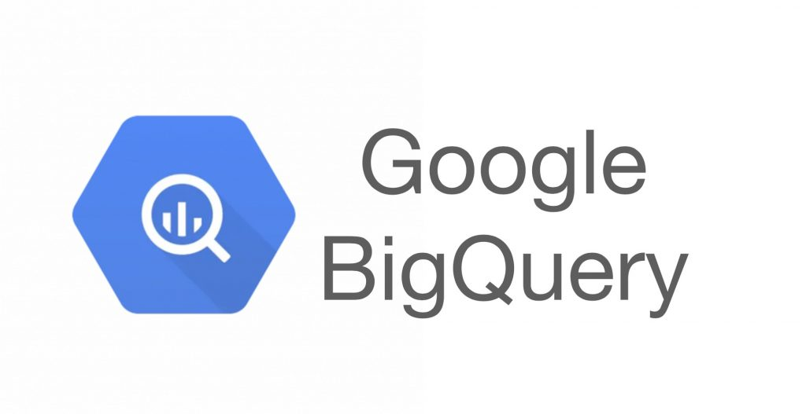

BigQuery 是一种全代管式企业数据仓库，可帮助您使用机器学习、地理空间分析和商业智能等内置功能管理和分析数据。

BigQuery 实现分析数据的计算引擎与存储选项分离，可最大限度地提高灵活性。

BigQuery 界面包括 Google Cloud Console 界面和 BigQuery 命令行工具。

        

<!--more-->

# Quick Begin
笔者感觉bq的配置、指令、命令行类的操作细节不该是本篇的关注的重点，否则文章会显得冗杂、无味，故对于此部分只会摘录google官网上的相关的文档链接，读者自行通读，在工作中边实践边学习。

本篇将主要集中于bq的存储、分析、管理等工作原理，以及工作中遇到的有价值的问题与知识。
## 快速入门
[1. Cloud Console](https://cloud.google.com/bigquery/docs/quickstarts/query-public-dataset-console?hl=zh-cn)
[2. 加载与查询数据](https://cloud.google.com/bigquery/docs/quickstarts/load-data-console?hl=zh-cn)
[3. 命令行工具](https://cloud.google.com/bigquery/docs/quickstarts/load-data-bq?hl=zh-cn)
[4.  客户端库](https://cloud.google.com/bigquery/docs/quickstarts/quickstart-client-libraries?hl=zh-cn#bigquery_simple_app_client-java)
[5. BQ java指令 github仓库](https://github.com/googleapis/java-bigquery/tree/f9f7abdede91e8f780d5a60b6ee9a26e9316d04d)

## 付费情况

## 流媒体

# Reference
1. [BQ官方文档](https://cloud.google.com/bigquery/docs/introduction?hl=zh-cn)