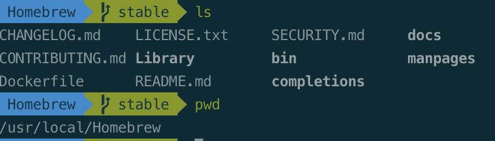
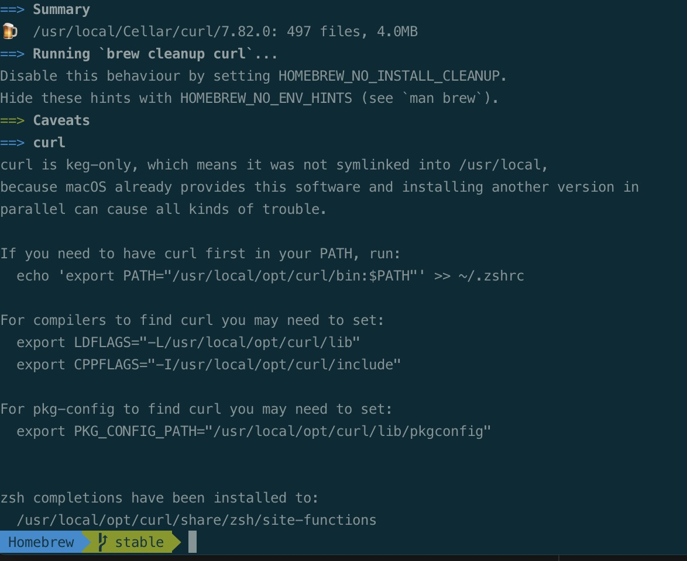
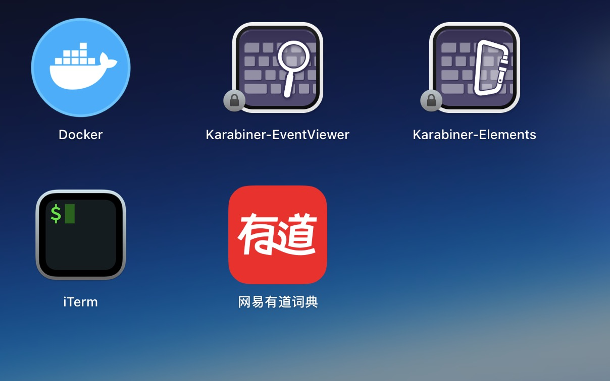

在使用mac系统的时候，和win 的一个区别在于sofeware的安装，要将从int下载下来的包，拽入app store中，安装在指定的位置。后来发现mac中存在一个工具——homebrew，能有效的帮助用户下载和管理相应的应用软件。本文也是记录下一些常用的homebrew的用法，提高homebrew的使用。

> What Does Homebrew Do?
> - Homebrew installs the stuff you need that Apple (or your Linux system) didn’t.
> - Homebrew installs packages to their own directory and then symlinks their files into /usr/local (on macOS Intel).
> - It’s all Git and Ruby underneath, so hack away with the knowledge that you can easily revert your modifications and merge upstream updates.
<center>
  
</center>

<!--more-->

# What Is Homebrew?
Homebrew: 是一款自由及开放源代码的软件包管理系统，用以简化macOS系统上的软件安装过程，最初由马克斯·霍威尔（Max Howell）写成。因其可扩展性得到了一致好评，而在Ruby on Rails社区广为人知。

Homebrew使用GitHub，通过用户的贡献扩大对软件包的支持。2012年，Homebrew是GitHub上拥有最多新贡献者的项目。2013年，Homebrew同时成为GitHub上最多贡献者及最多已关闭问题的项目。

默认安装在/usr/local，由一个核心git版本库构成，以使用户能更新Homebrew。包管理器使用一种称为“公式”（formula）的DSL脚本来管理依赖、下载源代码及配置和编译软件，从源代码中构建软件。称为“瓶”（bottle）的二进制包是用默认选项预编译好的公式。

# 安装、配置与使用流程

## homebrew的安装

1. 调用安装指令
```shell
# 下载安装脚本
/usr/bin/ruby -e "$(curl -fsSL https://raw.githubusercontent.com/Homebrew/install/master/install)"

# 安装路径
# curl 安装路径
cd /usr/local/Homebrew
```


如果在国内，使用brew会有一定的限制，可以选择换源,确保homebrew的使用。
> *笔者国内的公司可以合法访问外网，所以并未进行相应的换源。*
```shell
# 1. 替换为清华镜像源
cd "$(brew --repo)"
git remote set-url origin https://mirrors.tuna.tsinghua.edu.cn/git/homebrew/brew.git

# 替换homebrew-core.git
cd "$(brew --repo)/Library/Taps/homebrew/homebrew-core"
git remote set-url origin https://mirrors.tuna.tsinghua.edu.cn/git/homebrew/homebrew-core.git

# 刷新源
brew update


# 2. 替换为阿里云源
cd "$(brew --repo)"
git remote set-url origin https://mirrors.aliyun.com/homebrew/brew.git

# 替换homebrew-core.git
cd "$(brew --repo)/Library/Taps/homebrew/homebrew-core"
git remote set-url origin https://mirrors.aliyun.com/homebrew/homebrew-core.git

# 刷新源
brew update


# 3. 替换为腾讯云源
cd "$(brew --repo)"
git remote set-url origin https://mirrors.cloud.tencent.com/homebrew/brew.git

替换homebrew-core.git:
cd "$(brew --repo)/Library/Taps/homebrew/homebrew-core"
git remote set-url origin https://mirrors.cloud.tencent.com/homebrew/homebrew-core.git

# 刷新源
brew update
```
# cask
brew 是从下载源码解压然后 ./configure && make install ，同时会包含相关依存库。并自动配置好各种环境变量，而且易于卸载。 

brew cask 是 已经编译好了的应用包 （.dmg/.pkg），仅仅是下载解压，放在统一的目录中（/opt/homebrew-cask/Caskroom），省掉了自己去下载、解压、拖拽（安装）等蛋疼步骤，同样，卸载相当容易与干净。这个对一般用户来说会比较方便，包含很多在 AppStore 里没有的常用软件。

也可以理解为，**brew针对CLI程序，brew cask解决GUI程序的安装**。

brew 另一个好处可以管理软件的升级。

# 软件安装
1. 安装CLI软件以curl为例
```shell
# homebrew 安装curl
brew install curl
```


可以看到，curl的安装路径在
```shell
/usr/local/Cellar/curl/
```
> To clarify: The "Cellar" directory is a location that Homebrew made up for its own use. (The name fits with Homebrew's "beer" theme: the "cellar" is where you store your "kegs" of "homebrew".) No other software uses it. So if you don't need Homebrew and the programs you installed using Homebrew, you can delete Cellar.

 2. 安装GUI软件以有道词典为例:
```shell
# homebrew 安装有道词典
brew install --cask youdaodict
```




# brew 常用方法
- 安装软件: brew install git
- 卸载软件: brew uninstall git
- 搜索软件: brew search git
- 显示已经安装软件列表: brew list
- 删除旧版本安装包缓存: brew cleanup git、brew cleanup
- 查看那些已安装的程序需要更新: brew outdated
- 更新软件，把所有的Formula目录更新: brew update
- 更新某具体软件: brew upgrade git
- 锁定某个软件禁止更新: brew pin git
- 解除禁更锁定: brew unpin git
- 查看brew存放安装包的缓存地址: brew --cache
- 显示安装的服务: brew services list
- 启动: brew services start mysql
- 停止: brew services stop mysql
- 重启: brew services restart mysql

# 参考文档
[1. 知乎：brew和brew cask有什么区别？](https://www.zhihu.com/question/22624898)

[2. 知乎：homebrew与brew的常用命令](https://zhuanlan.zhihu.com/p/325795191)

[3. homebrew 官方文档](https://brew.sh/)