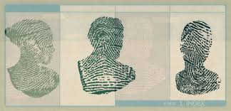

When I tried to build a database for images, a parameter was required to designed for the identification of each image. 

In this article, I explored how to establish the fingerprint of each image by combining its
image dhash code and text hash code.

	

<!--more-->

# Background
The fingerprint wsa needed when I tried to establish my database for images. This database not only should be able to
insert the new image record, but the old record can be updated when its image content changed. Therefore, it's necessary to
build a parameter including the features of primary key(format name) and image content.

To achieve this two features, I used this two methods below:

1. dHash (image feature)
2. hexdigest (image format name feature)

# dHash Method
In common case, there are three image hash methods(aHash, pHash and dHash) in mython.