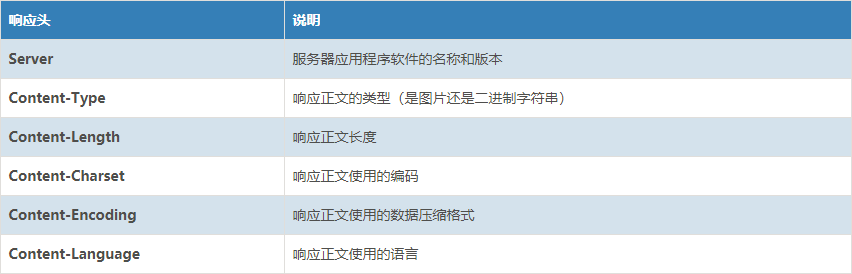

在实习的前两个星期，感觉最常接触的一类任务就是**数据的拉取**以及api的调用，本文也是对这个part的内容、方法以及遇到的问题进行一个记录。

<center>
        
</center>
<!--more-->


在向服务器发送拉取数据请求（比如asa，bigo等等），大多都是通过https request的请求实现。其中最常使用的method为GET 与POST,但是当需要我去解释http 报文结构， http request原理以及两个方法区别的时候，竟会一时语塞。这也是写此篇文章的目的，相信此时的记录有助我我对这类知识的理解，对后期的工作会有极大的帮助。
<center>
        
</center>

# 请求报文
一条请求信息主要四个部分组成：
1. 请求行 （request line）
2. 请求头部（header）
3. 空行（填充至头部区域结尾）
4. 请求数据（Optionally a message-body）

<center>
        
</center>

``` http
POST /user HTTP/1.1                       // 请求行
Host: www.user.com
Content-Type: application/x-www-form-urlencoded
Connection: Keep-Alive
User-agent: Mozilla/5.0.                  // 以上是请求头
（此处必须有一空行 |                         // 空行分割header和请求内容 
name=world                                // 请求体(可选，如get请求时可选)
```
## Request line
请求行由方法token开头，伴随着请求url，协议版本，以换行符，这几个部分由空格隔开。

## Request Method
请求方法指示要对给定 Request-URI 标识的资源执行的方法。

请求方法比较多：GET、POST、HEAD、PUT、DELETE、OPTIONS、TRACE、CONNECT，其中最常用的是GET和POST。

- GET
    使用 GET 的请求应该只检索数据，并且对数据没有其他影响。传递参数长度受限制，因为传递的参数是直接表示在地址栏中，而特定浏览器和服务器对url的长度是有限制的。GET**不适合用来传递私密数据**，也不适合拿来传递大量数据。

- POST
    POST把传递的数据封装在HTTP请求数据中，以名称/值的形式出现，可以传输大量数据，对数据量没有限制，也不会显示在URL中。

[more request methods](https://www.tutorialspoint.com/http/http_requests.htm
)

## Request Header
请求头部由关键字/值对组成，每行一对。
例如：  
-  User-Agent：产生请求的浏览器类型;

- Accept：客户端可识别的响应内容类型列表;星号 “ * ” 用于按范围将类型分组，用 “ / ” 指示可接受全部类型，用“ type/* ”指示可接受 type 类型的所有子类型;
比如 Accept：text/xml（application/json）表示希望接受到的是xml（json）类型。

- Accept-Language：客户端可接受的自然语言;

- Accept-Encoding：客户端可接受的编码压缩格式;

- Accept-Charset：可接受的应答的字符集;

- Host：请求的主机名，允许多个域名同处一个IP 地址，即虚拟主机;

- connection：连接方式(close 或 keepalive);

- Cookie：存储于客户端扩展字段，向同一域名的服务端发送属于该域的cookie;

- Content-Type：发送端发送的实体数据的数据类型。
比如，Content-Type：text/html（application/json）表示发送的是html类型

<center>
        
</center>

## Content-Type
常见的Content-Type：
|            Content-Type           |                                             解释                                            |
|:---------------------------------:|:-------------------------------------------------------------------------------------------:|
| text/html                         | html格式                                                                                    |
| text/plain                        | 纯文本格式                                                                                  |
| text/css                          | CSS格式                                                                                     |
| text/javascript                   | js格式                                                                                      |
| image/gif                         | gif图片格式                                                                                 |
| image/jpeg                        | jpg图片格式                                                                                 |
| image/png                         | png图片格式                                                                                 |
| application/x-www-form-urlencoded | POST专用：普通的表单提交默认是通过这种方式。form表单数据被编码为key/value格式发送到服务器。 |
| **application/json**                  | **POST专用：用来告诉服务端消息主体是序列化后的 JSON 字符串**                                   |
| text/xml                          | POST专用：发送xml数据                                                                       |
| multipart/form-data               | POST专用                                                                          |
## 空行
请求头之后是一个空行，通知服务器以下不再有请求头

## 请求体
GET没有请求数据，POST有。与请求数据相关的最常使用的请求头是 Content-Type 和 Content-Length 。

# 响应报文
HTTP响应由三个部分组成，分别是：状态行、消息报头、响应正文。
<center>
        
</center>
## Status line/状态行
由三个部分组成：
- **The protocol version（版本协议）**, usually HTTP/1.1.
- **A status code（状态码）**，indicating success or failure of the request. Common status codes are 200, 404, or 302
- **A status text（状态信息）**. A brief, purely informational, textual description of the status code to help a human understand the HTTP message.

## Headers/消息报头
[Response fields](https://en.wikipedia.org/wiki/List_of_HTTP_header_fields)
<center>
                
</center>

# 小结
> 通过上述分析，我们可以发现 HTTP 请求其实像发送邮件一样，请求头是我们附加的一些信息，可以告诉收件人，谁发的邮件，谁可以看，这是一封加密的邮件，你要根据什么规则把这封邮件翻译过来等等，请求内容当然就是我们要发送的具体内容。

> HTTP 响应就是收件人给我的回信，响应头会告诉我们一些附加信息，比如告诉我们，你发送的那个收件人没有（404）或者我正确收到了你的来信（200），我给你的响应是什么加密方式，你要怎么解码，响应内容就是他要告诉我们的具体内容。

# Python requests模块
在实习工作期间，经常会面对拉取服务器数据的需求，这个时候会频繁调用requests的模块来发送http 请求，有必要对此类的知识点进行一个总结整理。

Request官网上对该模块进行描述：

Requests is an elegant and simple HTTP library for Python, built for human beings.

## get
用于获取资源，当采用 GET 方式请求指定资源时， 被访问的资源经服务器解析后立即返回响应内容。通常以 GET 方式请求特定资源时， 请求中不应该包含请求体，所有需要向被请求资源传递的数据都应该通过 URL 向服务器传递。
``` python
# post 语法
response = requests.request("get", "http://www.baidu.com/")

# 添加headers，可以传入headers参数来增加请求头中的headers信息。
# 如果要将参数放在url中传递，可以利用 params 参数。
import requests
 
kw = {'wd': '北极熊'}
 
headers = {
    "User-Agent": "Mozilla/5.0 (Windows NT 10.0; Win64; x64) "
                  "AppleWebKit/537.36 (KHTML, like Gecko) "
                  "Chrome/54.0.2840.99 Safari/537.36"}
 
# params 接收一个字典或者字符串的查询参数，字典类型自动转换为url编码，不需要urlencode()
response = requests.get("http://www.baidu.com/s?", params=kw, headers=headers)
 
# 查看响应内容，response.text 返回的是Unicode格式的数据
print(response.text)
 
# 查看响应内容，response.content返回的字节流数据
print(response.content)
 
# 查看完整url地址
print(response.url)
 
# 查看响应头部字符编码
print(response.encoding)
 
# 查看响应码
print(response.status_code)
```


## post
POST 动作：用于提交数据， 当采用 POST 方式向指定位置提交数据时，数据被包含在请求体中，服务器接收到这些数据后可能会建立新的资源、也可能会更新已有的资源。同时 POST 方式的请求体可以包含非常多的数据，而且格式不限。因此 POST 方式用途较为广泛，几乎所有的提交操作都可以使用 POST 方式来完成。
``` python
import requests
 
formdata = {
    "type": "AUTO",
    "i": "i love python",
    "doctype": "json",
    "xmlVersion": "1.8",
    "keyfrom": "fanyi.web",
    "ue": "UTF-8",
    "action": "FY_BY_ENTER",
    "typoResult": "true"
}
 
url = "http://fanyi.youdao.com/translate?smartresult=dict&smartresult=rule&smartresult=ugc&sessionFrom=null"
 
headers = {
    "User-Agent": "Mozilla/5.0 (Windows NT 10.0; WOW64) "
                  "AppleWebKit/537.36 (KHTML, like Gecko) "
                  "Chrome/51.0.2704.103 Safari/537.36"}
 
response = requests.post(url, data=formdata, headers=headers)
 
print(response.text)
 
# 如果是json文件可以直接显示
print(response.json())
```

# 参考文档

1. [Requests: 让 HTTP 服务人类](https://docs.python-requests.org/zh_CN/latest/)