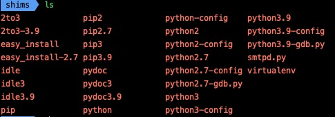

在python编程的过程中，经常需要在2.x 与  3.x 中进行切换，2和3两个版本间差异巨大，需要进行管理。

pyenv是一个forked自ruby社区的简单、低调、遵循UNIX哲学的Python环境管理工具, 它可以轻松切换全局解释器版本, 同时结合vitualenv插件可以方便的管理对应的包源.

pyenv和virtualenv。前者用于管理不同的Python版本，后者用 于管理不同的工作环境，能够极好得解决我们工作学习中遇到的python版本环境控制问题。
<!--more-->

# Pyenv简介
如前言所言，pyenv允许用户在不同版本的python中切换。pyenv基于rbenv进行开发，由ruby语言进行编程，为python而准备的。

## Pyenv 用处
1. 允许用户更改全局python的版本
2. 为每个python版本都提供支持
3. 允许使用环境变量重写python版本
4. 有助于使用 tox 跨 Python 版本进行测试

## Pyenv 不允许
1. pyenv是由shell 脚本编写的，不存在python的引导问题。
2. 需要将把pyenv安装目录载入到环境中。
3. pyenv无法管理虚拟环境，但是可以利用 virtualenv或者 pyenv-virtualenv实现。

# 工作原理

pyenv 就是使用了中间层的原理来实现的的，即 shims/垫片。

## 初始化 pyenv 
安装 pyenv 后，需要在当前 shell 的配置文件（bash 为 ~/.bashrc，zsh 为 ~/.zshrc 等等）中增加相应命令：

```bash
# vim ~/.bashrc
export PATH="/data/sammyshen/.pyenv/bin:$PATH"
eval "$(pyenv init -)"
eval "$(pyenv virtualenv-init -)"
```

这几个命令在每次登陆 shell 时，会更改 PATH 环境变量，将 pyenv 的路径加入到 PATH 环境变量前面。

## shims/垫片的简化基本原理
Linux 执行命令时，是依次遍历 PATH 环境变量的每个路径，查找所执行的命令。当在某个目录下找到第一个匹配时即停止遍历，所以 PATH 环境变量中，前面的路径比后面的路径具有更高的优先级。

pyenv 在 ~/.pyenv/shims 目录下创建了各种 python 相关命令的垫片（~/.bashrc 中加入的命令调用 pyenv-rehash 生成的，pyenv install 命令也会调用 pyenv-rehash 进行更新）

<center>
        
</center>

从脚本内容可以看出，当我们执行某个命令 program "param1" "param2" ……时，实际执行的是 pyenv exec "program" "param1" "param2" ……。

例如执行 python -V，实际执行的是 pyenv exec python -V。

## 确定版本号
在 pyenv-exec 命令中，首先会调用 pyenv-version-name 确定 python 版本或虚拟环境版本，具体查找规则为：
<center>
        
</center>

## 确定与版本号对应的可执行文件
在 pyenv-exec 命令中，会再调用 pyenv-which 确定可执行文件 program 的路径。如果前面 pyenv-version-name 确定了 python 版本或虚拟环境版本，则使用 <pyenv 安装路径>/versions/<版本号>/bin/<程序名> 或 <pyenv 安装路径>/versions/<版本号>/env/<虚拟环境名>/bin/<程序名>，否则遍历所有版本号的安装路径，按顺序取第一个匹配到的可执行文件。

##  执行命令
确定与版本号对应的可执行文件路径 path 之后，执行以下命令：
exec -a program "$path" "param1" "param2" ……

（注：即执行 "\$path" "param1" "param2"，并使用 program 作为程序名，程序名即 shell 中的 $0，python 中的 sys.argv0）
例如执行 python -V，确定 pyenv 版本为 2.7.17，对应可执行文件为 ~/.pyenv/versions/2.7.17/bin/python，则执行命令为：
exec -a python ~/.pyenv/versions/2.7.17/bin/python -V
以上就是 pyenv 执行命令的基本原理了。

# pyenv常用指令
```bash
# 创建新的环境,位于 ~/.pyenv/versions/
$ pyenv virtualenv 2.7.1 env271

# 切换到新的环境
$ pyenv activate env271

# 退回到系统环境
$ pyenv deactivate

# 删除新创建的环境
$ rm -rf ~/.pyenv/versions/env271/

# 查看当前 pyenv 可检测到的所有版本，处于激活状态的版本前以 * 标示。
$ pyenv versions
  system
* 3.5.1 (set by /root/.pyenv/version)
  3.5.1/envs/flask_py351
  3.5.1/envs/pelican

# 查看当前处于激活状态的版本，括号中内容表示这个版本是由哪条途径激活的（global、local、shell）
$ pyenv version
3.5.1 (set by /root/.pyenv/version)

# 使用 python-build（一个插件） 安装一个 Python 版本，到 $PYENV_ROOT/versions 路径下。
$ pyenv install -v 2.7.3

# 卸载
$ pyenv uninstall 2.7.3

# 为所有已安装的可执行文件 （如：~/.pyenv/versions/*/bin/*） 创建 shims，
# 因此，每当你增删了 Python 版本或带有可执行文件的包（如 pip）以后，都应该执行一次本命令
$ pyenv rehash

# 设置全局的 Python 版本，通过将版本号写入 ~/.pyenv/version 文件的方式。
$ pyenv global 3.4.0

# 设置面向程序的本地版本，通过将版本号写入当前目录下的 .python-version 文件的方式。
# 通过这种方式设置的 Python 版本优先级较 global 高。pyenv 会从当前目录开始向上逐级查找 .python-version 文件，直到根目录为止。
#若找不到，就用 global 版本。
$ pyenv local 2.7.3

# 设置面向 shell 的 Python 版本，通过设置当前 shell 的 PYENV_VERSION 环境变量的方式。
# 这个版本的优先级比 local 和 global 都要高。--unset 参数可以用于取消当前 shell 设定的版本。
$ pyenv shell pypy-2.2.1
$ pyenv shell --unset
```

# 参考文档
[1. pyenv-官方文档](https://github.com/pyenv/pyenv)

[2. pyenv神器原理分析](https://cloud.tencent.com/developer/article/1593478)
