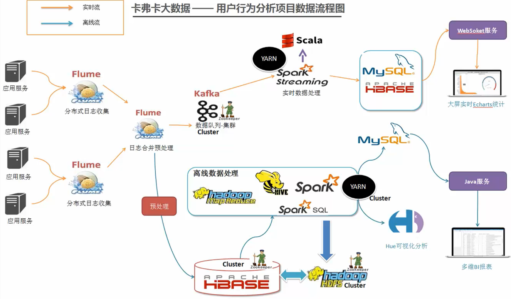
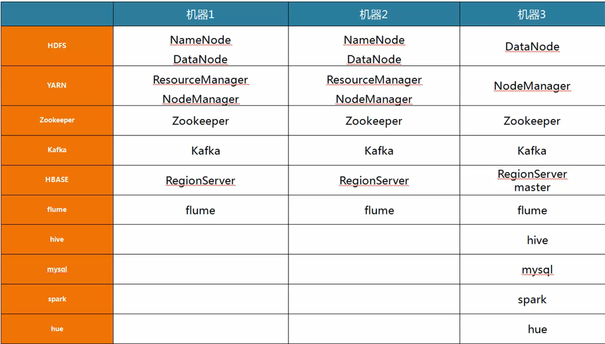
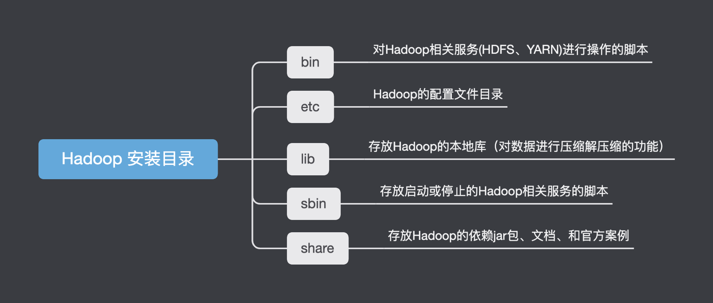
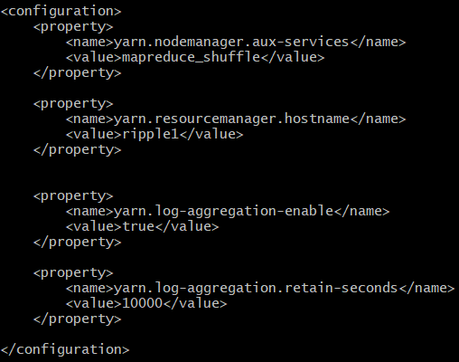
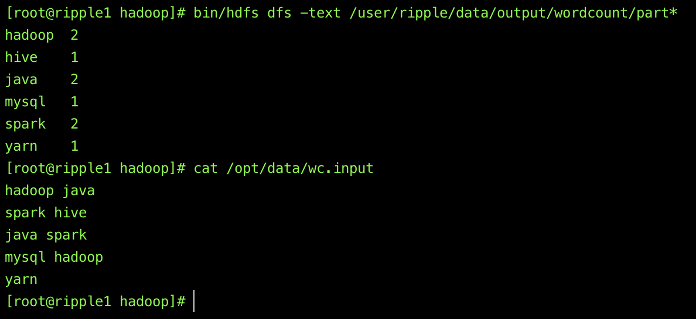

Ripple 该平台实现对当前新闻网舆论热点事件的实时可视化分析，主要在[B站:新闻网大数据实时分析可视化系统](https://www.bilibili.com/video/BV1mK411T7WY?p=1)这一项目基础进行进一步改造，使用框架组件包括：Hadoop、Zookeeper、Flume、Kafka、Hive、HBase、Cloudera HUE、Spark、Echart等。

本文主要Ripple项目的业务分析、技术造型、集群规划、安装部署、整合集成与开发和可视化设计等部分组成。项目目标为充分理解搭建过程中涉及的大数据组件，提升个人相关开发能力。

<!-- more -->
# 1. 项目需求分析、架构设计、数据流程设计
## 1.1 需求分析
1. 捕获用户浏览的日志信息(TB)
2. 实时分析前20名流量最高的新闻话题
3. 实时统计当前线上已曝光的新闻话题
4. 统计哪些时段用户浏览量最高
5. 报表

## 1.2 架构设计
<center>

</center>

## 1.3 数据流程
<center>

</center>

# 2. 环境配置
## 2.1 集群资源规划
该项目出于学习目的，比较腾讯云、阿里云、华为云等云服务，选择租用腾讯云的高性能云服务器,由于我们选择同一子网下的三台机器，所以我们只需使用节点的内网ip即可，并且保证了数据传输速度。  
<center>

</center>

三台服务器相关资源的部署规划如图所示:
<center>
  
</center>

<br>

为了方便三台云服务器间的数据传输与登录，需要设计三台云服务器间的ssh免密登录，其原理为将每台主机authorized_keys文件里面包含的主机（ssh密钥），该主机都能无密码登录，所以只要每台主机的authorized_keys文件里面都放入其他主机（需要无密码登录的主机）的ssh密钥即可,参考[Hadoop集群配置免密SSH登录方法](https://www.cnblogs.com/shireenlee4testing/p/10366061.html)。

完成ssh免密登录之后，由于ip地址相对难以记忆，通过修改/etc/hosts中的映射关系，这样能够方便再服务期间传输文件
```bash
# 利用如下指令,在hosts末尾中添加ip映射
vi /etc/hosts
```
<center>
  
</center>
<br>


## 2.2 Hadoop 搭建

首先，根据教程，再/opt文件夹下文件树为：
```bash
|-- opt # 主要文件夹
|   |-- data # 存放数据
|   |-- modules # haddop
|   |-- softwares # 相关软件下载包
|   |-- tool # 工具插件
|
```
在[A.hadoop资源下载](https://archive.apache.org/dist)中，-> hadoop -> core ->   hadoop-2.6.5.tar.gz，下载相关资源，并下载在software，最终解压至/opt/modules/，重命名为hadoop。

其中hadoop文件夹中的各文件及其功能如图所示:
<center>
    
</center>

- /bin 目录存放对Hadoop相关服务（HDFS, YARN）进行操作的脚本；
- /etc 目录存放Hadoop的配置文件
- /lib 目录存放Hadoop的本地库（对数据进行压缩解压缩功能）
- /sbin 目录存放启动或停止Hadoop相关服务的脚本
- /share 目录存放Hadoop的依赖jar包、文档、和官方案例

下载相关jdk也安装在/opt/modules中，配置/etc/profile环境变量。对于hadoop，有几个关键文件需要配置:

### 2.2.1 core-site.xml
路径: /opt/modules/hadoop/etc/hadoop

功能:  配置集群全局参数属性，用于定义系统级别的参数，如HDFS URL 、Hadoop的临时目录等

<center>
  
</center>

### 2.2.2 hdfs-site.xml
路径: /opt/modules/hadoop/etc/hadoop/hdfs-site.xml

功能: 配置HDFS组件的属性，如名称节点和数据节点的存放位置、文件副本的个数、文件的读取权限等

<center>
  
</center>

### 2.2.3 mapred-site.xml
路径: /opt/modules/hadoop/etc/hadoop/mapred-site.xml

功能：配置map-reduce组件的属性，包括JobHistory Server 和应用程序参数两部分，如reduce任务的默认个数、任务所能够使用内存的默认上下限等

<center>
    
</center>


### 2.2.4 yarn-site.xml
路径: /opt/modules/hadoop/etc/hadoop/yarn-site.xml

功能: 集群资源管理系统参数，配置ResourceManager ，nodeManager的通信端口，web监控端口等

<center>
    
</center>

### 2.2.5 hadoop-env.xml
路径: /opt/modules/hadoop/etc/hadoop/haddop-env.sh

功能: hadoop运行环境,用来定义hadoop运行环境相关的配置信息

<center>
    
</center>

## 2.3 启动集群
在2.2节中对hadoop文件夹下的bin与sbin进行了说明
> - /bin 目录存放对Hadoop相关服务（HDFS, YARN）进行操作的脚本；
> -  /sbin 目录存放启动或停止Hadoop相关服务的脚本

在启动集群的时候，主要调用/sbin中的函数。

首先,在**第一次启动**集群的时候，我们需要对Namenode进行格式化。

### 2.3.1 NameNode的格式化
**为什么需要格式化**

Hadoop NameNode是HDFS文件系统的集中位置，它保存文件系统中所有文件的目录树，并跟踪整个集群中文件数据的保存位置。简而言之，它将元数据与datanode保持相关。当我们格式化namenode时，它会**格式化与数据节点相关的元数据**。通过这样做，所有关于datanode的信息都将丢失，它们可以用于新数据。


**如何格式化**
格式化NameNode前，先关闭掉NameNode节点和DataNode节点，然后一定要删除hadoop目录下的data文件夹和log日志文件夹。最后再进行格式化。

```bash
bin/hadoop namenode -format
```
### 2.3.2 hdfs, yarn启动
####  hdfs启动流程
在完成NameNode的格式化之后，可以开始启动 hdfs(NameNode, DataNode, SecondaryNameNode) 与 yarn（ResourceManager，NodeManager）。
首先，启动hdfs。在2.3中了解，sbin文件夹是用来存储集群启动、关闭等时候调用的文件，其内部主要文件机器功能如下：
<center>
    
</center>

```
# 首先启动hdfs
sbin/start-dfs.sh

# 启动yarn
sbin/start-yarn.sh
```
> 在ripple1的启动hdfs，yarn情况如下，ripple1，ripple2，ripple3正常启动
<center>

</center>

<center>
    
</center>


#### hdfs启动出现问题
Q1: sbin/start-dfs.sh 后ripple2，ripple3机器datanode没有启动

A1: datanode与namenode 的clusterid不一致导致。

查看ripple2的日志。

``` shell
# 默认在hadoop的路径下
tail  -25 log/hadoop-root-datanode*.log
```

<center>
    
</center>


可以看到错误

```shell
2022-04-09 17:29:29,989 WARN org.apache.hadoop.hdfs.server.common.Storage: java.io.IOException: Incompatible clusterIDs in /tmp/hadoop-root/dfs/data: namenode clusterID = CID-55814a25-a013-48af-ad24-f4689b57728b; datanode clusterID = CID-34619a23-71d3-4112-9ab8-1d39fdbca5ad
2022-04-09 17:29:29,989 FATAL org.apache.hadoop.hdfs.server.datanode.DataNode: Initialization failed for Block pool <registering> (Datanode Uuid unassigned) service to ripple1/172.17.0.13:9000. Exiting.
java.io.IOException: All specified directories are failed to load.
	at org.apache.hadoop.hdfs.server.datanode.DataStorage.recoverTransitionRead(DataStorage.java:478)
	at org.apache.hadoop.hdfs.server.datanode.DataNode.initStorage(DataNode.java:1342)
	at org.apache.hadoop.hdfs.server.datanode.DataNode.initBlockPool(DataNode.java:1308)
	at org.apache.hadoop.hdfs.server.datanode.BPOfferService.verifyAndSetNamespaceInfo(BPOfferService.java:314)
	at org.apache.hadoop.hdfs.server.datanode.BPServiceActor.connectToNNAndHandshake(BPServiceActor.java:226)
	at org.apache.hadoop.hdfs.server.datanode.BPServiceActor.run(BPServiceActor.java:867)
	at java.lang.Thread.run(Thread.java:823)
2022-04-09 17:29:29,990 WARN org.apache.hadoop.hdfs.server.datanode.DataNode: Ending block pool service for: Block pool <registering> (Datanode Uuid unassigned) service to ripple1/172.17.0.13:9000
2022-04-09 17:29:30,091 INFO org.apache.hadoop.hdfs.server.datanode.DataNode: Removed Block pool <registering> (Datanode Uuid unassigned)
```
**原因**
这是我们在format namnode的时候会重置，导致namenode 的clusterID与datanode的clusterID不一致。

> You will get this error when the cluster ID of name node and cluster ID of data node are different. We can see the cluster ID of name node in <dfs.namenode.name.dir>/current/VERSION file and cluster ID of data node in <dfs.datanode.data.dir>/current/VERSION file.


**解决方案**：

预防措施：在format namenode之前，我们需要删除所有datanode上的 <dfs.datanode.data.dir> 路径下的所有目录。

解决方案：
- 方案一：如果hdfs中有数据且不想删除，复制namenode的version文件下的clusterID到各个datanode中的VERSION文件即可。
- 方案二：删除所有namnode与datanode的<dfs.datanode.data.dir> 下的文件，然后再重新format
    ```shell
    bin/hdfs namenode -format
    ```
 
#### 启动测试
利用yarn集群运行mapreduce程序，来测试hdfs与yarn是否正常启动。
主要代码为：
```shell
# 核心代码：利用yarn运行mapreduce程序
bin/yarn jar share/hadoop/mapreduce/hadoop-examples-2.6.5 wordcount 数据源目录 数据输出目录

# 事例代码
# hdfs 构建文件夹 -mkdir -p 路径
 bin/hdfs dfs -mkdir -p /user/ripple/data/input/
 # 本地文件存入hdfs之中
 bin/hdfs dfs -put /opt/data/wc.input /user/ripple/data/input/
 # yarn调用mapreduce 进行wordcount计算
 bin/yarn jar share/hadoop/mapreduce/hadoop-mapreduce-examples-2.6.5.jar wordcount /user/ripple/data/input/wc.input /user/ripple/data/output/wordcount
 #  查看运行结果
 bin/hdfs dfs -text /user/ripple/data/output/wordcount/part*
```

<center>
    
</center>

至此，hdfs与yarn的集群启动完毕。


**未完待续 | To be continued**


# 附录A：Problem

# 附录B：参考网站
1. [B站:新闻网大数据实时分析可视化系统](https://www.bilibili.com/video/BV1mK411T7WY?p=1)
2. [Hadoop官方文档](https://hadoop.apache.org/docs/r2.6.5/)
3. [A.hadoop资源下载](https://archive.apache.org/dist)
4. [B.hadoop资源下载](http://archive.cloudera.com/cdh5)
5. [What exactly is hadoop namenode formatting?](https://intellipaat.com/community/161/what-exactly-is-hadoop-namenode-formatting)
6. [datanode无法启动](https://sparkbyexamples.com/hadoop/incompatible-clusterids/)


