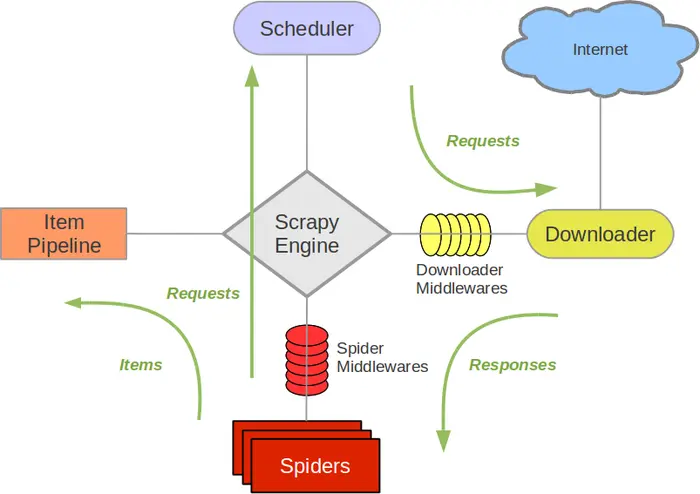

Scrapy是一个为了爬取网站数据，提取结构性数据而编写的应用框架。 可以应用在包括数据挖掘，信息处理或存储历史数据等一系列的程序中。

其最初是为了 页面抓取 (更确切来说, 网络抓取 )所设计的， 也可以应用在获取API所返回的数据(例如 Amazon Associates Web Services ) 或者通用的网络爬虫。

本文主要从两个部分展开： 
- 1. scrapy的定义、原理、框架等方面 
- 2. 实习中scrapy实战记录
- *3. scrapy 进阶知识
<center>
        
</center>

<!--more-->

# What is Scrapy?
## Scrapy 简介
Scrapy是一个为了爬取网站数据，提取结构性数据而编写的应用框架。 可以应用在包括数据挖掘，信息处理或存储历史数据等一系列的程序中。

其最初是为了 页面抓取 (更确切来说, 网络抓取 )所设计的， 也可以应用在获取API所返回的数据(例如 Amazon Associates Web Services ) 或者通用的网络爬虫。

## Scrapy框架、组件与流程
首先，给出scrapy的基本框架：
### Scrapy 框架
<center>
        
</center> 

### Scrapy组件
**Scrapy Engine(引擎)**: 负责Spider、ItemPipeline、Downloader、Scheduler中间的通讯，信号、数据传递等。

**Scheduler(调度器)**: 它负责接受引擎发送过来的Request请求，并按照一定的方式进行整理排列，入队，当引擎需要时，交还给引擎。

**Downloader（下载器）**：负责下载Scrapy Engine(引擎)发送的所有Requests请求，并将其获取到的Responses交还给Scrapy Engine(引擎)，由引擎交给Spider来处理，

**Spider（爬虫）**：它负责处理所有Responses,从中分析提取数据，获取Item字段需要的数据，并将需要跟进的URL提交给引擎，再次进入Scheduler(调度器)，

**Item Pipeline(管道)**：它负责处理Spider中获取到的Item，并进行进行后期处理（详细分析、过滤、存储等）的地方.

**Downloader Middlewares（下载中间件）**：你可以当作是一个可以自定义扩展下载功能的组件。

**Spider Middlewares（Spider中间件）**：你可以理解为是一个可以自定扩展和操作引擎和Spider中间通信的功能组件（比如进入Spider的Responses;和从Spider出去的Requests）


### Scrapy  流程

（1）引擎向Spider请求第一个要爬取的URL(s)。

（2）引擎从Spider中获取到第一个要爬取的URL，封装成Request并交给调度器。

（3）引擎向调度器请求下一个要爬取的Request。

（4）调度器返回下一个要爬取的Request给引擎，引擎将Request通过下载中间件转发给下载器。

（5）一旦页面下载完毕，下载器生成一个该页面的Response，并将其通过下载中间件发送给引擎。

（6）引擎从下载器中接收到Response并通过Spider中间件发送给Spider处理。

（7）Spider处理Response并返回爬取到的Item及新的Request给引擎。

（8）引擎将爬取到的Item给Item Pipeline，将Request给调度器。

（9）从（2）开始重复，直到调度器中没有更多的Request。

## 构建scrapy项目
### scrapy 安装
能够直接参考[官方安装文档](https://scrapy-chs.readthedocs.io/zh_CN/0.24/intro/install.html)，不多追叙，需要掌握一下pyenv与pyenv-virtualenv，构建python的虚拟环境。

### 构建scrapy项目
创建一个新的Scrapy项目。 进入您打算存储代码的目录中，运行下列命令:
```shell
scrapy startproject tutorial
```
该命令将会创建包含下列内容的 tutorial 目录:
```shell
tutorial/
    scrapy.cfg
    tutorial/
        __init__.py
        items.py
        pipelines.py
        settings.py
        spiders/
            __init__.py
            ...
```

这些文件分别是:

- scrapy.cfg: 项目的配置文件
- tutorial/: 该项目的python模块。之后您将在此加入代码。
- tutorial/items.py: 项目中的item文件.
- tutorial/pipelines.py: 项目中的pipelines文件.
- tutorial/settings.py: 项目的设置文件.
- tutorial/spiders/: 放置spider代码的目录.
只需要基于概况进行开发即可。

### 构建Iterm
Item 是保存爬取到的数据的容器；其使用方法和python字典类似， 并且提供了额外保护机制来避免拼写错误导致的未定义字段错误。

打开tutorial/items.py文件，创建一个 scrapy.Item 类， 并且定义类型为 scrapy.Field 的类属性来定义一个Item。

首先根据需要从"dmo.org（爬取的网页）"获取到的数据对item进行建模，我们需要从dmoz中获取名字，url，以及网站的描述。 对此，在item中定义相应的字段。编辑 tutorial 目录中的tutorial/items.py 文件:

``` python
import scrapy

class DmozItem(scrapy.Item):
    title = scrapy.Field()
    link = scrapy.Field()
    desc = scrapy.Field()
```

### 编写spider
Spider是用户编写用于从单个网站(或者一些网站)爬取数据的类。

其包含了一个用于下载的初始URL，如何跟进网页中的链接以及如何分析页面中的内容， 提取生成 item 的方法。

为了创建一个Spider，您必须继承 scrapy.Spider 类， 且定义以下三个属性:

- name: 用于区别Spider。 **该名字必须是唯一的**，您不可以为不同的Spider设定相同的名字。

- start_urls: 包含了Spider在启动时进行爬取的url列表。 因此，第一个被获取到的页面将是其中之一。 **后续的URL则从初始的URL获取到的数据中提取**。

- parse() 是spider的一个方法。 被调用时，每个初始URL完成下载后生成的 Response 对象将会作为**唯一的参数**传递给该函数。 该方法负责解析返回的数据(response data)，**提取数据(生成item)**以及**生成需要进一步处理的URL的 Request 对象**。

```python
# sample code
import scrapy

class DmozSpider(scrapy.Spider):
    # unique spider name
    name = "dmoz"
    # 允许的网页路径为dmoz.org域名下
    allowed_domains = ["dmoz.org"]
    # start urls
    start_urls = [
        "http://www.dmoz.org/Computers/Programming/Languages/Python/Books/",
        "http://www.dmoz.org/Computers/Programming/Languages/Python/Resources/"
    ]
    # 解析返回的reponse吗，生成item，进一步生成request
    # 此处代码没有显示相关功能
    def parse(self, response):
        filename = response.url.split("/")[-2]
        with open(filename, 'wb') as f:
            f.write(response.body)
```
### 爬取内容
```python
scrapy crawl dmoz
# 在我的mac上需要制定python
python -m scrapy crawl dmoz
```

### 提取Item

**1. Selectors 选择器介绍**

从网页中提取数据有很多方法。Scrapy使用了一种基于 XPath 和 CSS 表达式机制: Scrapy Selectors 。 关于selector和其他提取机制的信息请参考 Selector文档 。*后期可以写一下相关的博客，深入研究一下。*

Selector有四个基本的方法(点击相应的方法
- xpath(): 传入xpath表达式，返回该表达式所对应的所有节点的**selector list列表** 。
- css(): 传入CSS表达式，返回该表达式所对应的所有节点的selector list列表.
- extract(): 序列化该节点为unicode字符串并返回**list**。
- re(): 根据传入的正则表达式对数据进行提取，返回unicode字符串list列表


每个 .xpath() 调用返回selector组成的list，因此我们可以拼接更多的 .xpath() 来进一步获取某个节点

### 保存数据
Item 对象是自定义的python字典。 您可以使用标准的字典语法来获取到其每个字段的值。(字段即是我们之前用Field赋值的属性):

```python
import scrapy

from tutorial.items import DmozItem

class DmozSpider(scrapy.Spider):
    name = "dmoz"
    allowed_domains = ["dmoz.org"]
    start_urls = [
        "http://www.dmoz.org/Computers/Programming/Languages/Python/Books/",
        "http://www.dmoz.org/Computers/Programming/Languages/Python/Resources/"
    ]

    def parse(self, response):
        for sel in response.xpath('//ul/li'):
            item = DmozItem()
            item['title'] = sel.xpath('a/text()').extract()
            item['link'] = sel.xpath('a/@href').extract()
            item['desc'] = sel.xpath('text()').extract()
            yield item
```

调用结果：
```
[dmoz] DEBUG: Scraped from <200 http://www.dmoz.org/Computers/Programming/Languages/Python/Books/>
     {'desc': [u' - By David Mertz; Addison Wesley. Book in progress, full text, ASCII format. Asks for feedback. [author website, Gnosis Software, Inc.\n],
      'link': [u'http://gnosis.cx/TPiP/'],
      'title': [u'Text Processing in Python']}
[dmoz] DEBUG: Scraped from <200 http://www.dmoz.org/Computers/Programming/Languages/Python/Books/>
     {'desc': [u' - By Sean McGrath; Prentice Hall PTR, 2000, ISBN 0130211192, has CD-ROM. Methods to build XML applications fast, Python tutorial, DOM and SAX, new Pyxie open source XML processing library. [Prentice Hall PTR]\n'],
      'link': [u'http://www.informit.com/store/product.aspx?isbn=0130211192'],
      'title': [u'XML Processing with Python']}
```
该命令将采用 JSON 格式对爬取的数据进行序列化，生成 items.json 文件。

```python
scrapy crawl dmoz -o items.json
```
# 事件日志


# 参考
1. [Scrapy框架的运作流程](https://book.itheima.net/course/221/1270308787172941826/1271354340677787651)
2. [Scrapy框架简介](https://segmentfault.com/a/1190000013178839)
3. [Scrapy官方文档](https://scrapy-chs.readthedocs.io/zh_CN/0.24/intro/overview.html)

