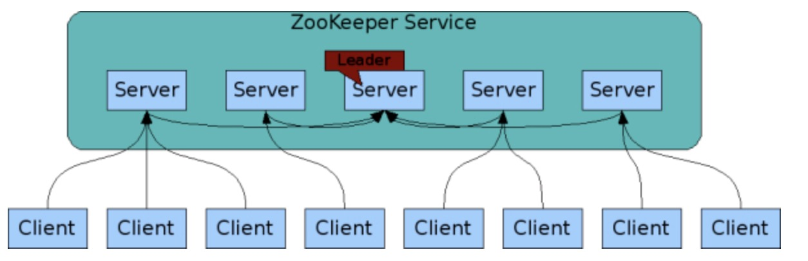
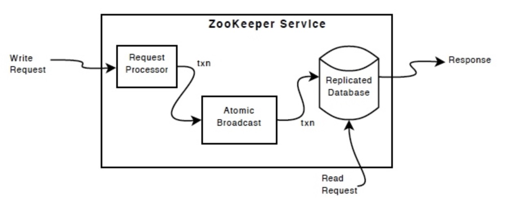
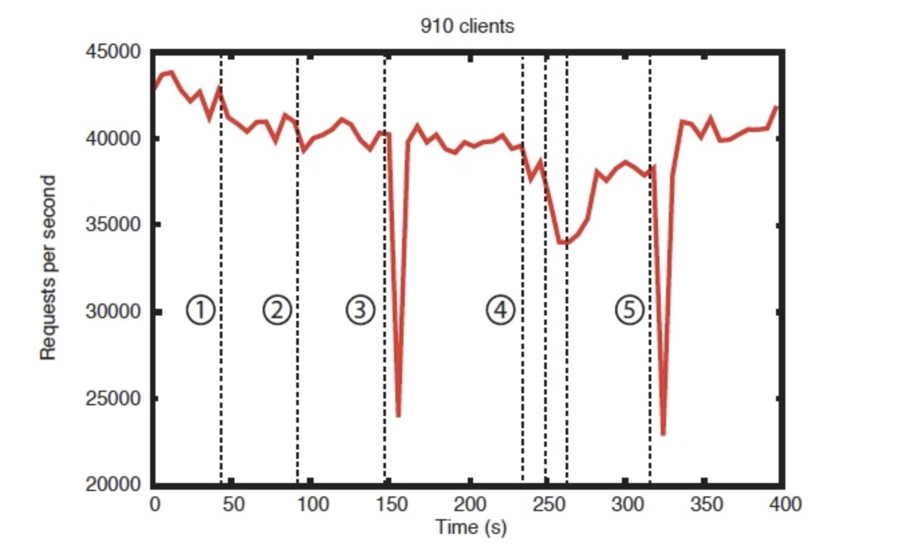

ZooKeeper是一个分布式、开源的分布式应用协调服务。它公开了一组简单的原语，分布式应用程序可以在此基础上构建，以实现同步、配置维护、组和命名等更高级别的服务。它的设计是易于编程的，并使用了一个数据模型，其样式类似于熟悉的文件系统的目录树结构。它在Java中运行，并且有Java和C的绑定。

众所周知，协调服务很难做好。它们特别容易出现竞争条件和死锁等错误。ZooKeeper背后的动机是为了减轻分布式应用从头开始实现协调服务的责任。

        

<!--more-->

# What is zookeeper
ZooKeeper是一个分布式、开源的分布式**应用协调服务**。它公开了**一组简单的原语**，分布式应用程序可以在此基础上构建，以实现同步、配置维护、组和命名等更高级别的服务。它的设计是易于编程的，并使用了一个数据模型，其样式类似于熟悉的文件系统的目录树结构。它在Java中运行，并且有Java和C的绑定。

众所周知，协调服务很难做好。它们特别容易出现竞争条件和死锁等错误。ZooKeeper背后的动机是为了**减轻分布式应用从头开始实现协调服务的责任**。

# What is zookeeper's goals?
## zookeeper 结构简单
ZooKeeper允许分布式进程通过一个**共享的层次命名空间相互协调**，这个命名空间的组织方式**类似于标准的文件系统**。命名空间由数据寄存器组成——用ZooKeeper的话说叫做znode——它们类似于文件和目录。与典型的存储文件系统不同，**ZooKeeper的数据保存在内存中**，这意味着ZooKeeper可以实现**高吞吐量和低时延**。

## zookeeper 是被复制的

                

组成zookeeper的服务器都认识彼此，它们在内存中维护状态图像，以及持久存储中的事务日志和快照。只要大多数服务器可用，ZooKeeper 服务就可用。

**"2n+1原则"**：集群中运行的机器需要超过一半
- “2n+1”的原因是zookeeper应用需要可靠性/可用性，与性能无关
- ZooKeeper集合(服务集群)是由一个或多个服务器组成的，这些服务器对每个更改进行“投票”。大多数原始服务器在接受任何更改之前都需要“批准”。
- 集成中有 3 台服务器（n=1），如果其中一台出现故障，服务仍然正常（2 台占多数）。但是，如果第二台服务器发生故障，则服务将关闭。

## zookeeper是有序的
ZooKeeper 使用反映所有 ZooKeeper 事务顺序的数字标记每个更新。后续操作可以使用顺序来实现更高级别的抽象，例如同步原语。

## zookeeper很迅速
它在“以读取为主”的工作负载中尤其快。 ZooKeeper 应用程序在数千台机器上运行，它在读取比写入更常见的情况下表现最佳，比率约为 10:1。

# 数据模型与命名空间
ZooKeeper 提供的命名空间很像标准文件系统。名称是由斜杠 (/) 分隔的一系列路径元素。 ZooKeeper 命名空间中的每个节点都由路径标识。

                

## 节点与临时节点
与标准的文件系统不同，ZooKeeper名称空间中的每个节点都可以有与其关联的数据以及子节点。这就像拥有一个允许文件同时也是目录的文件系统。(ZooKeeper是用来**存储协调数据**的:**状态信息、配置信息、位置信息**等，所以每个节点存储的数据通常很小，在字节到千字节之间。)我们使用术语znode来说明我们谈论的是ZooKeeper数据节点。

znode维护一个统计结构，其中包括数据更改的版本号、ACL更改和时间戳，以允许缓存验证和协调更新。znode的数据每次更改，版本号就会增加。例如，每当客户端检索数据时，它也会接收到数据的版本。

存储在名称空间中的每个znode上的数据是原子式读写的。读获取与znode关联的所有数据字节，写则替换所有数据。每个节点都有一个访问控制列表(Access Control List, ACL)来限制谁可以做什么。

ZooKeeper也有临时节点的概念。只要创建znode的会话处于活动状态，这些znode就会存在。当会话结束时，删除znode。

# zookeeper特点
- 顺序一致性
- 原子性
- 单一系统映像：无论客户端连接到哪个服务器，客户端都将看到相同的服务视图。即，即使客户端故障转移到具有相同会话的不同服务器，客户端也永远不会看到系统的旧视图。
- 可靠性
- 实效性

# 调用接口api
- create : creates a node at a location in the tree
- delete : deletes a node
- exists : tests if a node exists at a location
- get data : reads the data from a node
- set data : writes data to a node
- get children : retrieves a list of children of a node
- sync : waits for data to be propagated

# zookeeper组成
除了请求处理器(request processor)之外，组成 ZooKeeper 服务的每个服务器都复制自己的每个组件的副本。

复制数据库是包含整个数据树的内存数据库。更新被记录到磁盘以便恢复，写入在应用到内存数据库之前被序列化到磁盘。

每个 ZooKeeper 服务器都服务于客户端。客户端仅连接到一台服务器以提交请求。**从每个服务器数据库的本地副本为读取请求提供服务**。请求会改变服务状态，其中写请求，由协议协议处理。

作为协议协议的一部分，来自客户端的所有写入请求都被转发到单个服务器，称为领导者（leader）。余下服务器称为跟随者（follower），并接收来自领导者的消息提议并同意消息传递。

# 表现
zookeeper在读超过写的时候，性能较高，因为写涉及到同步所有服务器的状态。

                

# 可靠性

> 为了显示系统在注入故障时的行为，我们运行了一个由 7 台机器组成的 ZooKeeper 服务。我们运行与之前相同的饱和度基准测试，但这次我们将写入百分比保持在恒定的 30%，这是我们预期工作负载的保守比率。

                

图像中存在几个重要的观察特点：
1. 如果追随者失败并迅速恢复，那么即使失败，ZooKeeper 也能够维持高吞吐量。

2. 领导者选举算法允许系统以足够快的速度恢复，以防止吞吐量大幅下降。ZooKeeper 用不到 200 毫秒的时间来选举一个新的领导者。

3. 随着追随者的恢复，ZooKeeper 能够在他们开始处理请求后再次提高吞吐量。

# 参考文档
[1. zookeeper 概述](https://zookeeper.apache.org/doc/r3.4.14/zookeeperOver.html)

[2. zookeeper 2n+1 原理](https://stackoverflow.com/questions/4228227/what-does-2n-1-quorum-mean)