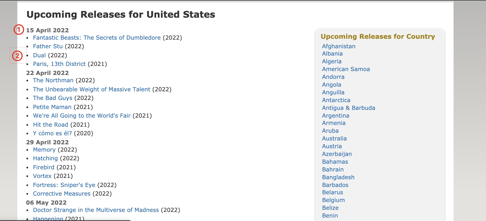

在有了一定的scrapy基础之后，便可以尝试将scrapy的知识应用起来，做一些小项目。本文将介绍一个基于scrapy的imdb数据爬取项目，其主要功能有以下三点：
- 对imdb网页，指定id电影信息，最受欢迎榜单数据，新片榜单

- 数据清洗、查重与入库

- 脚本编写，定时运行，鲁棒性检测

        

<!--more-->
# 简介
## 前言
在实习期间，流媒体部分的同事需要imdb相关的数据，这个任务最后落在了我的身上，正好这个项目与公司项目相对独立，不涉及保密协议的部分，所以我打算将这个项目放在自己的github上，深入自己对scrapy的理解，同时也丰富自己的工程经验。

Github入口： [imdb-scrapy：基于scrapy的imdb数据爬取项目](https://github.com/wjmars98/imdb-scrapy)

## 项目需求
### 爬取对象

**1. IMDB影片信息获取**
根据IMDB链接，获取IMDB页面信息供资讯站内容填充，所需信息如下(详见图片)：
例子：https://www.imdb.com/title/tt10048342/
- ID：10048342
- 影片标题
- IMDB评分
- 影片热度：popularity，对应图中302
- 影片描述
- 影片图片：封面图，尺寸(像素)：198*261，大小：≤50k
- 影片IMDB ID
更新频率：24小时/次

        

**2. IMDB新片上映信息获取**
根据IMDB新片上映页面，获取影片信息供资讯站内容筛选参考，所需信息如下(详见图片)：
- 新片上映页面：https://www.imdb.com/calendar/
- 影片上映时间：包含年月日
- 影片名称：包含年份
- 影片热度：点击影片获取影片热度，如图③
- 影片IMDB ID
- 影片链接

更新频率：24小时/次
爬取条数：最近两个月的影片

        

        

**3. IMDB喜爱榜单信息获取**
根据IMDB喜爱榜单页面，获取影片信息供资讯站内容筛选参考，所需信息如下(详见图片)：
新片上映页面：https://www.imdb.com/chart/moviemeter/?ref_=nv_mv_mpm
- 排名
- 影片名称：包含年份
- IMDB 评分
- 影片IMDB ID
- 影片链接
- 影片热度：点击影片获取影片热度

更新频率：24小时/次
爬取条数：前100条

        

## 框架与数据流

## 数据库设计

# 项目编写

## scrapy脚本

## 数据库

## 自动化部署

# 项目结果

# 参考