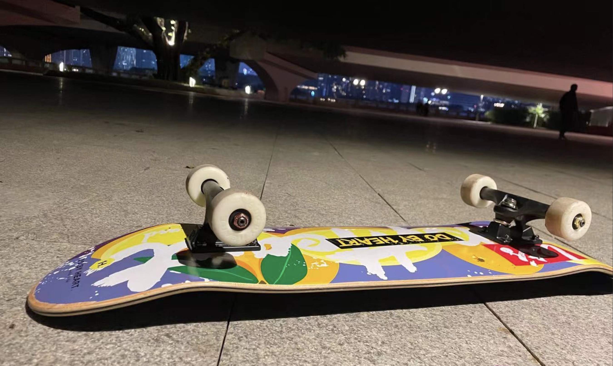

我之后会不断记录下自己的想法、自己的生活，或者对之前的想法进行批判。希望这篇随想是随想的录的开始而非结束。

综上，为了应对未来的中年危机，我有提升技术的必要，但千万不能以为仅仅自己凭借技术能养活自己一辈子；其次，我得去寻找自身的平衡点，了解多个领域的知识，尽量做跨领域的工作，能够减少自身的竞争压力；第三，当前国内就业环境太差，我可以利用自己出国留学的机会，正确去国外工作几年，相信国外的工作经验也是自己的长期竞争力之一。我们要学会构建自己的长期竞争力，而构建自身长期竞争力的方法与途径就是不断对自己进行长期投资。

        

<!--more-->

# 前言

到广州实习的第一个月，遇见了各类形形色色的人，做了陌生完全不熟悉的事，接受的海量的外界信息，对自己的生活态度乃至价值观产生了巨大的冲击。

最近自己逐渐养成了一个习惯——思考。不但是对眼前所欲事物的思考，更是对自己职业规划，自己人生理想与目标的思考。虽然和父母的交流中，他们更希望我不要多想，安心做眼前的事物。但是我还是觉得多思考总归是胜于麻木盲从，思考也让我受益非浅。

遂建立随想录这一目录，记录一些自己的思考过程与结果，或长或短，或真知灼见，或可笑万分，我姑且都记下，就当作是眼下生活的小小总结，留下些许痕迹。

# 正文
最近，一直在思考自己未来10年后，也就是程序员的35岁的中年危机我该如何度过。30到35岁是一道坎，很多搞技术的人也就倒在这到坎上，一蹶不振，我该如何去应对，是否应该按部就班的听我父母一步一个脚印走好，比如：找份大厂工作，好好努力，一步一个脚印走上高级技术员或者管理层等等。

在和俊哥吃饭的时候，我也聊到35危机的问题，他提出一个长期竞争力，我觉得还是挺有道理。

第一，是扎实底层技术。我们常说核心竞争力，但是到底什么是核心竞争力呢？说白了，就是你的某个优势，别人难以取代，可以称为你的核心竞争力。俊哥也由此展开，说明互联网的技术日新月异，但是其底层的技术其实变化十分缓慢，如果把底层的技术打扎实了，那么学习新技术的时间也就很短，能维持自己长期的竞争力，这点是值得我去思考与学习的，不断扎实自己对底层技术的了解。

第二，平衡点。中国是一个人口大国，近年经济形势下滑，考研考公人数屡创新高，这也说明了在未来的一段时间人才与职位会出现供大于求，竞争异常激烈。

第一条路，不断提升自己技术，卷过绝大多数人。这也是我父母期望我走的路，按部就班，一步一个较硬。但是这难度真的实在太大了，竞争的人数是如此之多，而且未来会更多，我们每个人就像一颗螺丝钉，完全可以替换，对自己的健康也会有很大的损坏，而且我也不认为自己是一个长于技术的人，这条路对我来说性价比不高，虽然技术是我的立足之本，但我不能靠技术吃一辈子的饭。

第二条路，寻找自己多领域的平衡点。当前的赛道竞争对手是如此之多，是否有办法寻找一条跨学科交叉的道路，减少我们的竞争压力。比如数据与金融的结合，数据与车企的结合，数据与医疗的结合等等，这都是值得我去研究的领域。找到适合自己的平衡点，多放下注，广积粮（扎实技术，保持多领域信息优势，减少信息差）、缓称王（不要没思考、调研，就浪费大量精力前进）。

第三条路，更换自己的环境。目前国内的就业环境不行，但并不代表这国外的坏境不行。可以尝试去外企，或者一步到位直接利用自己去hk留学的继续，去hk或者新加坡、新西兰、澳大利亚找相应的岗位，也是未尝不可。这里又涉及绿卡移民的问题，值得我之后为此专门写一篇文章聊聊。

我要时刻问问自己，自己向往什么样的生活？成为大厂的一颗螺丝钉，还是有自己的生活，实现wlb。永远学会去投资自己，要做长期投资，比如学习新的技能（保持生活的新鲜感），扎实自己的技术（这是我的立足之本），多结交优秀的朋友（了解更多行业的情况），等等。

虽然长期投资的回报是有延后性的，但是长期投资的回报也是丰厚。因为我们在时间是公平的，我们在对自己进行长期投资，正是在培养自身的长期竞争力，而别人要取代你的优势，也需要付出相应的时间成本，这是有门槛的，所以多做对自己作长期投资吧，我的朋友。

虽然长期投资是如此重要，但这也不代表着我们要放弃短期的收益，比如准备考试、应酬、娱乐等等。短期投资，回报快，能增长自己生活的激情。但是千万不要做竭泽而渔，比如沉迷于游戏，沉迷于无意义的消遣。任何致瘾的都是有害的，千万小心。

# 结尾
综上，为了应对未来的中年危机，我有提升技术的必要，但千万不能以为仅仅自己凭借技术能养活自己一辈子；其次，我得去寻找自身的平衡点，了解多个领域的知识，尽量做跨领域的工作，能够减少自身的竞争压力；第三，当前国内就业环境太差，我可以利用自己出国留学的机会，正确去国外工作几年，相信国外的工作经验也是自己的长期竞争力之一。我们要学会构建自己的长期竞争力，而构建自身长期竞争力的方法与途径就是不断对自己进行长期投资。

我之后会不断记录下自己的想法、自己的生活，或者对之前的想法进行批判。希望这篇随想是随想的录的开始而非结束，

